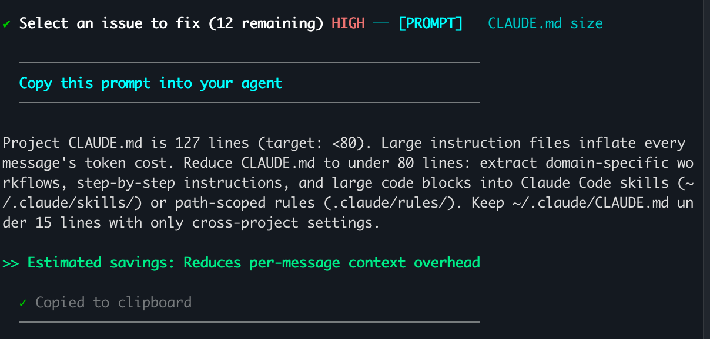
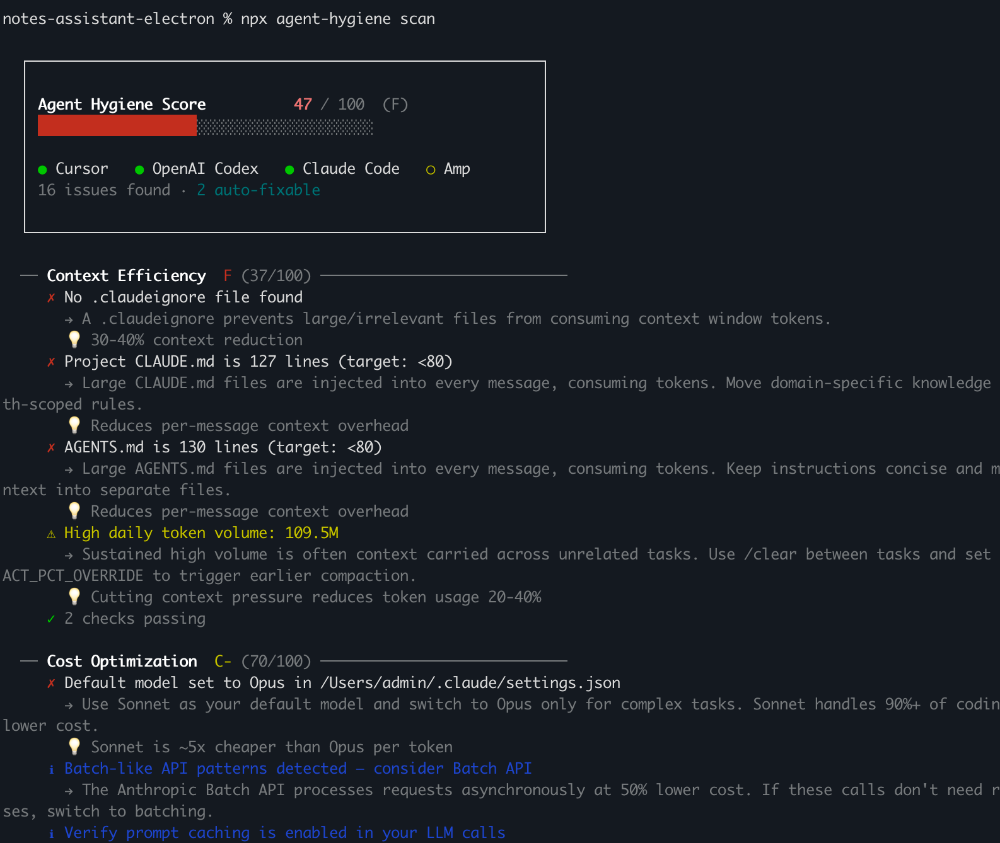
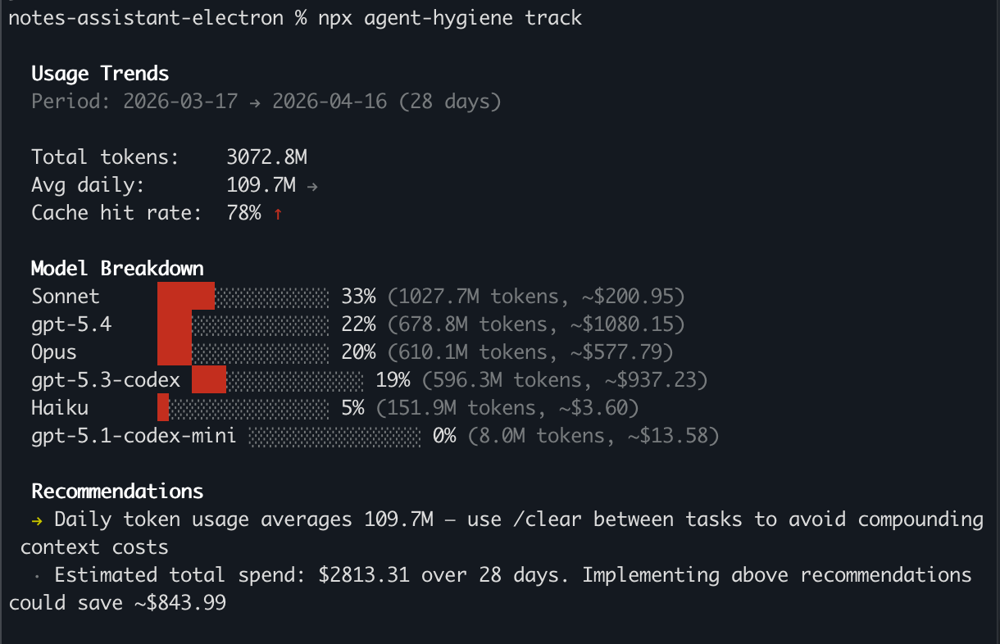

# agent-hygiene


Your agents are dirty, inefficient, and wasting resources.

Clean your agents -> Improve your habits -> Save the world 🌍

_Leaderboard soon?_

## Quick Start

```bash
npx agent-hygiene scan
```

Let agents help you clean w/ exact prompts.

```bash
npx agent-hygiene scan --fix
```



## Example Output



## What It Checks

25 checks across four categories. Auto checks read your config files. Session checks analyze real usage via AgentsView. Advisory checks are habit reminders.

### Context Efficiency (35% of score)

| Check | Tier | What it catches |
|---|---|---|
| `.claudeignore` coverage | Auto | Build artifacts flooding context |
| `CLAUDE.md` size | Auto | System prompt over 80 lines |
| `AGENTS.md` size | Auto | Codex instructions over 80 lines |
| Skills vs fat CLAUDE.md | Auto | Domain knowledge crammed into CLAUDE.md instead of skills |
| MCP tool search deferral | Auto | All MCP tools loaded upfront instead of deferred |
| Context window pressure | Session | Peak session exceeding 100K tokens |

### Cost Optimization (30% of score)

| Check | Tier | What it catches |
|---|---|---|
| Autocompact threshold | Auto | No compaction until context is already huge |
| Subagent model override | Auto | Subagents running on Opus instead of Haiku |
| Default model selection | Auto | Opus set as default model |
| Opus model overuse | Session | >40% of tokens going to the priciest model |
| Prompt cache efficiency | Session | <30% cache hit rate |
| Subagent cost efficiency | Session | Subagents burning Opus tokens |
| Batch API | Advisory | Not using 50%-cheaper async API for bulk work |
| Prompt caching | Advisory | Missing explicit cache_control in SDK calls |
| Sonnet as default | Advisory | Hasn't explicitly set Sonnet as default |

### Structure (20% of score)

| Check | Tier | What it catches |
|---|---|---|
| Path-scoped rules | Auto | No `.claude/rules/` directory |
| Settings JSON schema | Auto | Missing `$schema` in settings.json |
| Merge tiny rule files | Auto | Too many small rule files that should be combined |
| Codex configuration | Auto | Missing or misconfigured Codex setup |

### Habits (15% of score)

| Check | Tier | What it catches |
|---|---|---|
| Session length management | Session | Days with >1M tokens or avg >300K daily |
| `/clear` between tasks | Advisory | Context bleeding between unrelated tasks |
| `/btw` for side questions | Advisory | Breaking flow for quick lookups |
| Default effort level | Advisory | Running at max effort when low/medium works |
| Delegate to subagents | Advisory | Doing research in the main thread |
| Plan mode for complex work | Advisory | Jumping into multi-file changes without `/plan` |

All 20 techniques documented here: [docs/techniques/](./docs/techniques/)

## Features

- `scan` - letter grade (A+ to F) with category breakdown and per-check details
- `scan --fix` - auto-fix failing checks where possible
- `snapshot save/compare` - before/after baselines with cost deltas
- `track` - token usage trends, model cost breakdown, cache hit rates (via [AgentsView](https://agentsview.com))
- `profile` - all-time stats and blind spots (checks that have never passed)
- `history` - rolling score history with sparkline
- `export` - anonymized JSON for leaderboard sharing (shipping soon)
- `badge` - shields.io-style SVG for your repo



## CI Integration

Want to use Agent Hygiene in a GitHub Action? See an untested example in [action.yml](./action.yml).

## AgentsView Integration

5 of the 22 checks (the Session tier) rely on real token usage data from your agent sessions. [AgentsView](https://github.com/wesm/agentsview) provides that data- it reads your local agent logs and calculates per-session costs, model breakdowns, and cache hit rates without sending anything off your machine.

Without AgentsView installed, those 5 checks get skipped and you'll see a notice in the scan output.

To install:

```bash
curl -fsSL https://agentsview.io/install.sh | bash
```

On Windows:

```powershell
powershell -ExecutionPolicy ByPass -c "irm https://agentsview.io/install.ps1 | iex"
```

Once installed, run `agent-hygiene scan` again and the Session checks (Opus overuse, context bloat, cache miss rate, session length, subagent cost) will light up.

## LeanMaxxing Leaderboard (coming soon)

TokenMaxxers can't have all the fun.

## Agents Supported

Claude Code, Codex

Want to add checks for Cursor, Windsurf, Copilot, or another agent? There's a step-by-step prompt that walks your AI through the entire process- discovery, checks, tests, and docs. See [contrib/add-agent-checks/PROMPT.md](https://github.com/pi0neerpat/agent-hygiene/blob/main/contrib/add-agent-checks/PROMPT.md).

## References

- Thanks to [@atre](https://github.com/atre) for the inspiration and the original techniques behind this project. Read his article: [Claude Code in Production](https://herashchenko.dev/blog/claude-code-in-production/)
- Thanks to [@tkmx](https://github.com/tkmx) for the inspiration for the leaderboard.

## License

MIT - Copyright (c) 2026 Patrick Gallagher
